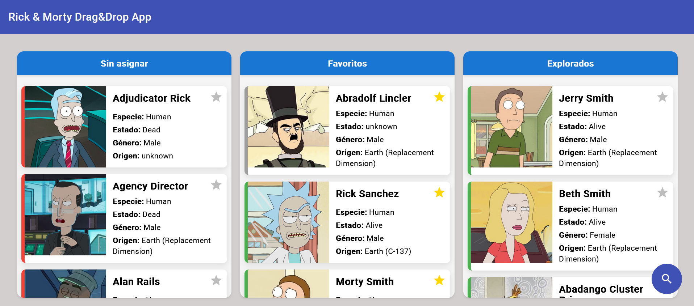

🌀 Rick & Morty Drag & Drop App

Una aplicación web desarrollada en Angular 17 que muestra personajes de la serie Rick and Morty, distribuidos en tres columnas con soporte completo de drag and drop, utilizando la librería Atlaskit Pragmatic Drag and Drop.

Este proyecto forma parte de mi portafolio y demuestra habilidades en desarrollo frontend moderno, consumo de APIs, UX interactiva, animaciones personalizadas y gestión dinámica de estados.

preview

🚀 Demo en línea

📌 Características
🖼️ Interfaz moderna y responsiva

    Diseño de tarjetas compacto y elegante, con layout horizontal: imagen a la izquierda, información a la derecha.

    Estilos dinámicos basados en el estado del personaje: alive, dead, unknown.

🧩 Tablero interactivo

    Tres columnas:

        🔹 Sin asignar

        ⭐ Favoritos

        ✅ Explorados

    Cards se pueden arrastrar libremente entre columnas.

    Reordenamiento dentro de la misma columna con animación de inserción.

🖱️ Drag & Drop avanzado

    Soporte para detección de borde (closest edge) al insertar cards entre otras.

    Animaciones visuales con triggerPostMoveFlash al soltar una tarjeta.

    Resaltado visual de la tarjeta objetivo al arrastrar sobre ella (hover-target).

    Cursor y comportamiento personalizado para mejorar la experiencia.

🔍 Buscador flotante

    Botón flotante siempre visible con icono de lupa (mat-fab).

    Al hacer clic se expande un campo de búsqueda animado en la parte inferior derecha.

    Filtrado en tiempo real de personajes por nombre.

🌟 Favoritos

    Icono de estrella sobre cada card.

    Al marcar como favorito:

        La estrella cambia de color.

        La tarjeta se mueve automáticamente a la columna "Favoritos".

🎨 Detalles UX/UI

    Animaciones al reordenar o mover tarjetas entre columnas.

    Evita mover tarjetas al final si se insertan entre otras (gestión del closest edge).

    Optimización con trackBy para evitar renders innecesarios.

🧱 Tecnologías usadas

    Angular 17

    TypeScript

    RxJS

    SCSS (Sass)

    Angular Material

    Atlaskit Pragmatic Drag and Drop

    Rick and Morty API

📦 Instalación

git clone https://github.com/AndreyMolina91/drag-and-drop-app.git
cd rick-morty-drag-app
npm install
ng serve

🧠 Aprendizajes clave

    Integración avanzada de drag-and-drop con lógica de inserción relativa (closest edge).

    Manejo de estados dinámicos y visuales con signal() y Angular reactive context.

    Implementación de patrones UX con feedback inmediato visual y táctil (vibración y animación).

    Organización de un diseño estilo Kanban con arquitectura standalone en Angular.

📌 Pendientes o mejoras futuras

Soporte para guardar estado en localStorage o backend.

Añadir paginación o scroll infinito para más personajes.

    Mejorar accesibilidad con live regions y teclado.

¿Te gusta este proyecto? ⭐ ¡Dale una estrella en GitHub y compártelo en LinkedIn!
✍️ Contáctame para colaboraciones
